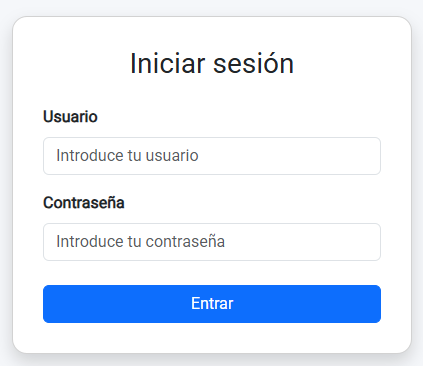
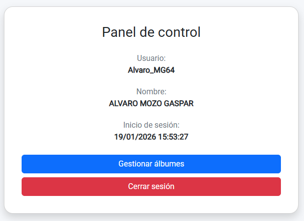
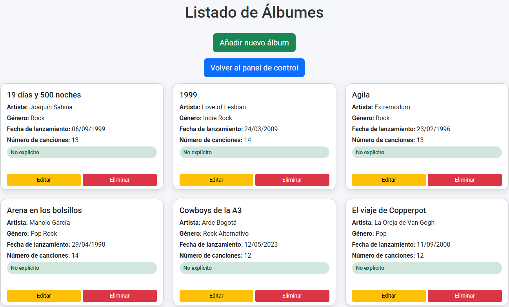
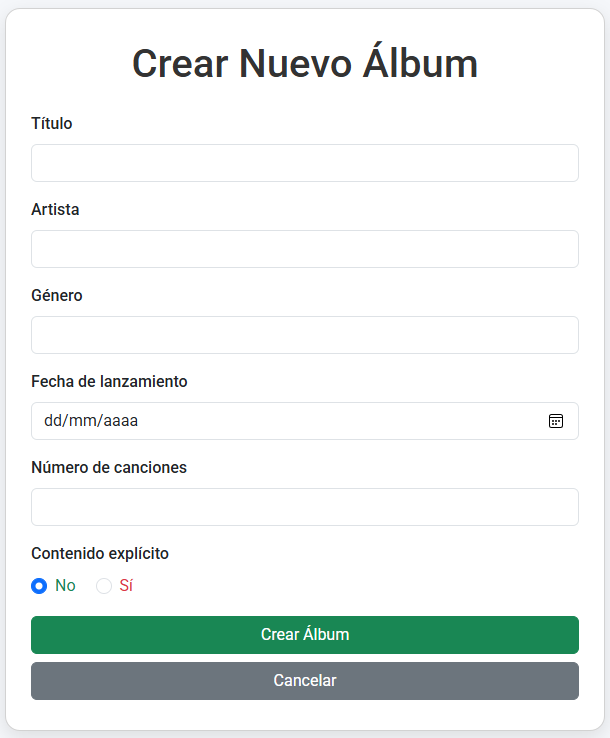
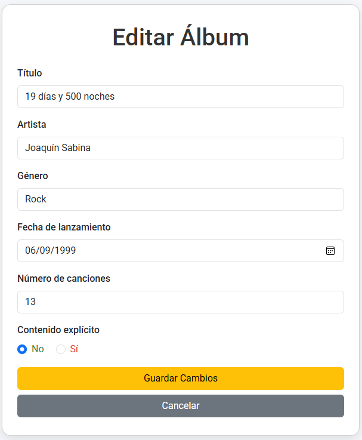

# 🎵 Aplicación PHP MVC: Login + CRUD de Álbumes de Música

Este proyecto consiste en una aplicación web desarrollada en **PHP** que integra un sistema de **autenticación de usuarios** y un **CRUD (Create, Read, Update, Delete)** para la gestión de álbumes de música, siguiendo el patrón de arquitectura **MVC (Modelo–Vista–Controlador)**.

La aplicación ha sido desarrollada como **práctica académica**, aplicando buenas prácticas de organización, seguridad y diseño responsive mediante **Bootstrap 5**.

---

## 📌 Descripción general

La aplicación permite:

- Autenticar usuarios mediante login seguro
- Gestionar sesiones protegidas
- Acceder a un panel de control
- Gestionar un catálogo de álbumes musicales (CRUD completo)
- Visualizar si un álbum contiene contenido explícito
- Mantener separación clara entre lógica, datos y presentación

---

## ⚙️ Tecnologías utilizadas

- PHP
- MySQL
- PDO
- phpMyAdmin
- HTML5
- CSS3
- Bootstrap 5
- JavaScript

---

## 📂 Estructura del proyecto

```
AlbumManager/
│
├── index.php
├── generar_insert_hash.php
├── README.md
│
├── config/
│   └── Database.php
│
├── controllers/
│   ├── AuthController.php
│   └── AlbumController.php
│
├── models/
│   ├── Usuario.php
│   └── Album.php
│
├── views/
│   ├── login.php
│   ├── dashboard.php
│   ├── listar.php
│   ├── crear.php
│   └── editar.php
│
├── sql/
│   ├── usuarios.sql
│   └── albumes.sql
│
└── public/
    └── js/
        ├── validaciones_usuario.js
        └── validaciones_album.js
```

---

## 🔐 Sistema de autenticación (LoginMVC)

### Funcionamiento

- Autenticación mediante usuario y contraseña
- Contraseñas almacenadas con **hash seguro**
- Uso de **sesiones PHP**
- Acceso restringido a zonas protegidas
- Cierre de sesión seguro

Solo los usuarios con el campo `admitido = 1` pueden iniciar sesión.

---

## 🗄️ Base de datos

La aplicación utiliza una base de datos llamada `login-php`


### Tabla `usuarios`

Campos:

- `coduser` → Clave primaria autoincremental
- `idusuario` → Nombre de usuario único
- `password` → Contraseña cifrada con hash
- `nombre` → Nombre del usuario
- `apellidos` → Apellidos del usuario
- `admitido` → Campo booleano de control de acceso

---

### Generación de contraseñas seguras

El archivo **generar_insert_hash.php** permite generar automáticamente los INSERTs con contraseñas cifradas usando `password_hash`, sin necesidad de usar terminal.

#### Uso:

1. Abrir en el navegador: `http://localhost/AlbumManager/generar_insert_hash.php`
2. Copiar los INSERTs generados
3. Pegarlos en `sql/usuarios.sql`
4. Importar el archivo en phpMyAdmin

El login verificará las contraseñas mediante `password_verify`.

---

## 📀 CRUD de Álbumes de Música

El CRUD de álbumes está **protegido por sesión** y solo es accesible tras iniciar sesión correctamente.

### Funcionalidades

- Crear nuevos álbumes
- Listar álbumes existentes
- Editar álbumes
- Eliminar álbumes
- Orden alfabético por título
- Indicador visual de contenido explícito
- Confirmación antes de eliminar

---

### Campos de la tabla `albumes`

- `idAlbum` → Clave primaria autoincremental
- `titulo` → Título del álbum
- `artista` → Artista o grupo
- `genero` → Género musical
- `fecha_lanzamiento` → Fecha de lanzamiento
- `num_canciones` → Número de canciones
- `es_explicit` → Indica si el contenido es explícito (0 / 1)

---

## 📸 Capturas de la aplicación

A continuación se muestran algunas capturas representativas del funcionamiento de la aplicación **AlbumManager**, incluyendo el sistema de autenticación y el CRUD de álbumes.

### 🔐 Pantalla de Login


### 🧭 Panel de control (Dashboard)


### 📋 Listado de álbumes


### ➕ Crear álbum


### ✏️ Editar álbum


---

## 📥 Importación de la base de datos

### Pasos:

1. Acceder a **phpMyAdmin**
2. Crear o seleccionar la base de datos `login-php`
3. Importar:
- `sql/usuarios.sql`
- `sql/albumes.sql`

Tras la importación:
- La tabla `usuarios` queda lista para login
- La tabla `albumes` incluye registros de ejemplo

---

## 🧠 Arquitectura MVC

- **Modelos**: acceso a datos mediante PDO
- **Controladores**: lógica de negocio y control de flujo
- **Vistas**: presentación con Bootstrap 5
- **index.php**: Front Controller y enrutador

---

## ✅ Validaciones y seguridad

### Seguridad aplicada

- Contraseñas cifradas (`password_hash`)
- Verificación segura (`password_verify`)
- Consultas preparadas con PDO
- Control de acceso mediante sesión
- Regeneración del ID de sesión
- Logout seguro
- Confirmación antes de eliminar registros

### Validaciones

- Validación HTML5 en formularios
- Validación visual con Bootstrap (`needs-validation`)
- Sanitización de datos en el servidor

---

## 🎨 Diseño responsive

- Diseño realizado con **Bootstrap 5**
- Interfaz clara y consistente
- Uso de tarjetas, tablas responsivas y badges
- Indicadores visuales (verde / rojo) para contenido explícito
- Tipografía clara y legible

---

## 🚀 Ejecución del proyecto

1. Copiar la carpeta del proyecto en `htdocs`
2. Iniciar Apache y MySQL
3. Importar los archivos SQL
4. Acceder desde el navegador a: `http://localhost/index.php`
5. Iniciar sesión
6. Acceder al panel de control y gestionar álbumes

---

## 📌 Estado del proyecto

El proyecto implementa correctamente:

- Login seguro en PHP
- Gestión de sesiones
- CRUD completo de álbumes
- Arquitectura MVC
- Diseño responsive

Queda preparado para futuras ampliaciones como roles de usuario, tokens CSRF avanzados, paginación o registro de usuarios.

---

## ✍️ Autoría

**Álvaro Mozo Gaspar**